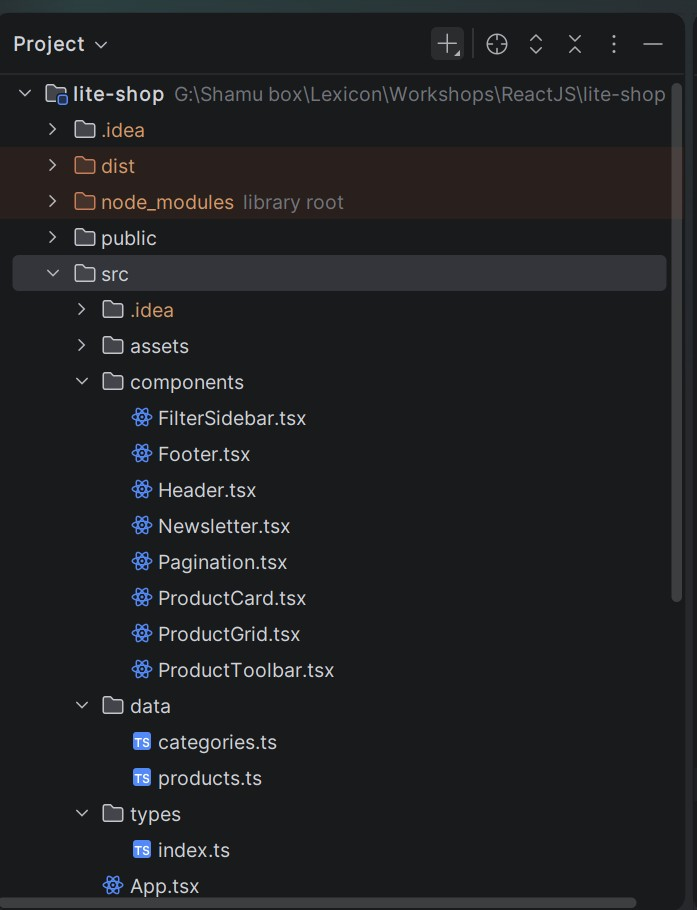

# LITE.SHOP — Product Listing (Workshop 1: React Components & Props)

A React recreation of a product listing page (`index.html`) built with React, Vite, TypeScript, Tailwind CSS, and lucide-react. The focus of this workshop was component thinking, reusability, and passing data via props.

## Tech Stack

- React + TypeScript
- Vite (build tool)
- Tailwind CSS (styling)
- lucide-react (icons)

## Project Structure

## Components

### `Header`
The top navigation bar: logo, nav links, search input, cart button, account button, and mobile menu button.
- **Props:** `cartCount: number`
- **Why a prop:** the cart badge (the small red number on the cart icon) needs to reflect how many items are in the cart. Passing it as a prop keeps `Header` reusable — it doesn't need to know *how* the cart count is calculated, just what number to display. The badge only renders if `cartCount > 0`.

### `FilterSidebar`
The left sidebar containing category filters, a price range slider, availability checkboxes, and a promo card.
- **Props:** `categories: CategoryItem[]`
- **Why a prop:** the list of categories (label, count, checked state) is data that could change independently of the component's layout, so it's passed in rather than hardcoded. Price range and availability sections were kept static since their content doesn't vary in this workshop's scope.

### `ProductToolbar`
The row showing the page title ("Recommended for you") and the sort dropdown.
- **Props:** `title: string`
- **Why a prop:** allows the same toolbar component to be reused with a different heading if the product section changes (e.g. "New Arrivals" instead of "Recommended for you") without touching the component's code.

### `ProductGrid`
Renders the responsive grid of product cards by looping over the product data.
- **Props:** none directly (imports `products` from `data/products.ts` internally)
- **Why:** keeps `ProductGrid` focused purely on layout and mapping — each individual product's display logic lives in `ProductCard`.

### `ProductCard`
Displays a single product: image, hover overlay actions, status badge, favorite button, category, rating, name, stock text, price, and add-to-cart button.
- **Props:** `product: Product`, `onAddToCart?: () => void`
- **Why props:** this is the most reused component in the app (rendered once per product), so every piece of content that varies between products (name, price, badge, discount, disabled state) is passed in as a single `product` object rather than as many separate props. This keeps the component's interface clean and makes it trivial to add more products later without touching `ProductCard` itself. `onAddToCart` is an optional callback prop passed down from `ProductGrid`, so the click behavior (currently logging to console) can be changed in one place without modifying `ProductCard`.
- Conditional rendering is used for the badge (`{badge && (...)}`) and discounted price (`{originalPrice && (...)}`), since not every product has these.

### `Pagination`
Displays page number buttons and previous/next arrows.
- **Props:** `currentPage: number`, `totalPages: number`
- **Why props:** lets the same component highlight whichever page is active and show the correct total page count, without hardcoding page numbers into the component.

### `Newsletter`
The dark "Join the LITE.CLUB" newsletter signup section.
- **Props:** none — content is static since this section only appears once and its text doesn't vary.

### `Footer`
The site footer: brand info, social links, three link columns (Shop/Support/Company), and a copyright bar.
- **Props:** none — footer column data (`footerColumns`) is defined internally, since it's only used once and unlikely to change.
- Uses a nested `.map()`: the outer loop renders each column (Shop, Support, Company), and an inner loop renders each link within that column — demonstrating mapping over nested/repeated data, not just a flat list.

## How Components Work Together

`App.tsx` composes all components into the final page layout: